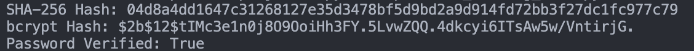

# 🔐 Password Security & Hashing Demo

A Python project demonstrating **secure password hashing** using **SHA-256** and **bcrypt**.

## 📌 Overview
Passwords are one of the most common attack vectors in cybersecurity.  
This project shows how hashing works and why **secure password storage** matters.

The project demonstrates:
- Hashing a password with **SHA-256**
- Using **bcrypt** for stronger, salted hashes
- Verifying passwords securely

---

## 📷 Example Output



---

## 🛠️ Tools & Technologies
- **Python 3.8+**
- **hashlib** (built-in library)
- **bcrypt** (`pip install bcrypt`)

---

## 🚀 How to Run

1. **Clone the repository**:
   ```bash
   git clone https://github.com/yourusername/password-hashing-demo.git
   cd password-hashing-demo
   ```

2. **Install dependencies**:
  ```bash
  pip install bcrypt
  ```

3. Run the script:
  ```bash
  python password_hashing_demo.py
  ```

---

## 🧠 Key Takeaways

- Hashing ≠ Encryption → Hashing is one-way, encryption is reversible.
- Salted hashing (e.g., bcrypt) is preferred for storing passwords.
- Never store plain-text passwords.

---

## 🎯 Future Enhancements

- Add a GUI demo for non-technical users.
- Compare performance between SHA-256 and bcrypt.
- Show password cracking simulations.
